# LUI

	A Vue.js UI Toolkit for Web

`卢超`<br />`2017/06/17`
****

### 按钮

>按钮类型 默认/danger/success/warning 四种 [type="danger"]

```html
 <lu-button>默认按钮</lu-button>
 <lu-button type="danger">危险按钮</lu-button>
 <lu-button type="success">成功按钮</lu-button>
 <lu-button type="warning">警告按钮</lu-button>
```


>滑过按钮 四种类型 同上 [:plain="true"]


>按钮大小 超大(large) / 默认 / 小型(small) / 超小型(mini) 四种 [size="large"]


>去除按钮默认圆角 [:radius="false"]


>按钮禁用 [:disabled="true"]

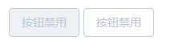

>按钮添加图标 icon="lu-icon-delete2"


### Badge 标记

>数据[:value="97786"] 隐藏Badge [:hidden="true"] 默认false，是否红点显示 [:isDot="true"] 默认 false 设置颜色[color="#333"] 默认 红色

```html
<lu-badge :value="97786" color="#333">
    <lu-button size="small">小型按钮</lu-button>
</lu-badge>

<lu-badge :value="7245" :isDot="true">
    <lu-button size="small">小型按钮</lu-button>
</lu-badge>

<lu-badge :value="7245" :hidden="true">
    <lu-button size="small">小型按钮</lu-button>
</lu-badge>
```


### 移动端 信息弹窗提示

>提示信息字符串[message:string], 显示位置[position:top/middle/boottom], 显示时间长度[duration:time] 添加自己的class[className="my-class"]

```javascript
this.$lu_toast({
	message: '信息弹窗提示',
	position: 'top',
	duration: 1500
});
```


### switch 开关

>@change,@input事件，返回值 true/false , 绑定初始值[v-model=" "] , 禁用[:disabled="true"]

```html
<lu-switch v-model="witch1" @change="change1">{{witch1}}</lu-switch>
<lu-switch v-model="witch2" @input="input1" :disabled="true">{{witch2}}</lu-switch>
```


### PC端 信息弹窗提示

>默认（info）/error/success/warning 四种 [type="danger"]

```javascript
this.$lu_message({
    type:'error',
    message: '危险错误提示'
})
或
this.$lu_message.error('危险错误提示')
```

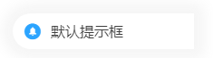
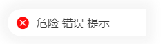
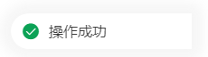
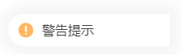

### input输入框

>v-model="value"绑定值，maxlength最大输入长度 ，输入框大小 超大(large) / 默认 / 小型(small) / 超小型(mini) 四种 [size="large"],输入时触发@input=" "

```html
<lu-input 
    v-model="inputValue0" 
    maxlength="5" 
    size="large" 
    @input="changeInput"
    @focus="focusInput"
    @blur="blurInput" />
```

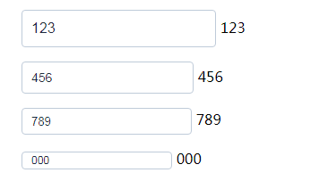

### Tag标签

>类型 (默认) / gray / primary / success / warning / danger 六种 也可以通过color="#009e4d"设置背景色 是否可关闭 :closable="true" 默认false

```html
<lu-tag :closable="true" @close="closeTag(1)">默认标签</lu-tag>
<lu-tag type="gray" :closable="true">gray标签</lu-tag>
<lu-tag type="primary" :closable="true">primary标签</lu-tag>
<lu-tag type="success" :closable="true">success标签</lu-tag>
<lu-tag type="warning" :closable="true">warning标签</lu-tag>
<lu-tag type="danger" :closable="true">danger标签</lu-tag>
<lu-tag color="#009e4d" :closable="true" @close="closeTag(2)">自定义背景色标签</lu-tag>
```

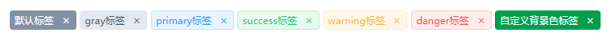

### pagination 分页

```html
<lu-pagination 
    :page-count="100" 
    :current-page="currentPage" 
    @current-change="handleCurrentChange"
    @prev-click="prevClick"
    @next-click="nextClick"
/>
```

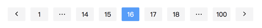

### Alert 警告(lu-alert)

>default-value 默认值, @change value值改变时触发改函数

```html
<lu-alert 
    title="成功提示的文案"
    type="success"
    description="文字说明文字说明文字说明文字说明文字说明文字说明"
    show-icon 
    :closable="false"/>
<lu-alert 
    title="消息提示的文案"
    type="info"
    description="文字说明文字说明文字说明文字说明文字说明文字说明"
    show-icon 
    center/>
<lu-alert 
    type="warning"
    description="文字说明文字说明文字说明文字说明文字说明文字说明"
    show-icon />
<lu-alert 
    title="错误提示的文案"
    type="error"
    description="文字说明文字说明文字说明文字说明文字说明文字说明"
    @close="close()"/>
```
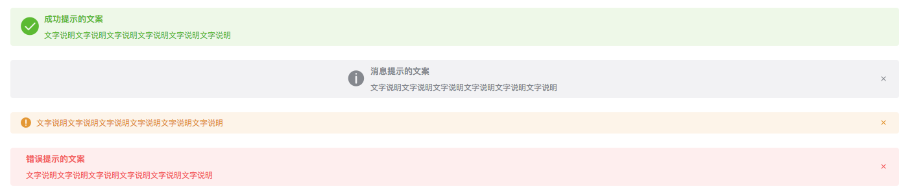

### Radio 单选框(lu-radio)

>name 原生name属性

```html
<lu-radio name="radio" v-model="radio" :resource="resource"  />
```

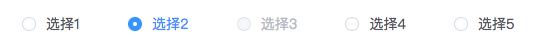

### InputNumber 计数器(lu-input-number)

>step 计数器步长,min max 最小值 最大值

```html
<lu-input-number v-model="numberInputValue" :step="1" :min="-2" :max="10" />
```

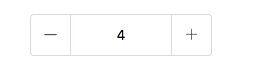

### Progress 进度条(lu-progress)

>percent 百分比, size 大小 large/medium/small（默认), shape类型 circle 圆形/line 直线（默认）

```html
<lu-progress :percent="percentNumber" size="large" shape="circle" />
<lu-progress :percent="percentNumber" size="medium" shape="circle" />
<lu-progress :percent="percentNumber" size="small" shape="circle" /> 

<lu-progress :percent="percentNumber" size="large" />
<lu-progress :percent="percentNumber" size="medium" />
<lu-progress :percent="percentNumber" size="small" />
```

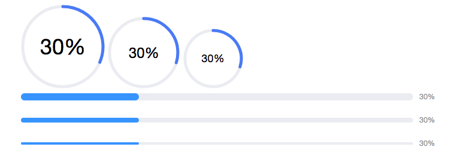

****

> log 记录

* 2018-08-06 11:39:55 feat:DatePicker
* 2018-08-08 00:41:05 feat:DatePicker组件完成
* 2018-08-08 10:34:49 feat:添加若干iconfont图标
* 2018-08-08 11:33:52 feat:完善lu-pagination组件
* 2018-08-08 14:49:34 docs:添加pagination分页器文档
* 2018-08-08 14:54:00 docs:添加pagination分页器文档
* 2018-08-08 15:21:27 feat:完善lu-pagination组件
* 2018-08-09 18:04:54 feat:tab
* 2018-08-09 18:17:20 style:完善tab
* 2018-08-16 16:04:08 feat:alert组件
* 2018-08-16 16:38:08 feat:alert组件关闭事件
* 2018-08-17 10:56:42 style:重命名所有组件名称
* 2018-08-17 11:00:36 docs:修改文档README.md
* 2018-08-17 16:22:13 feat:Radio单选框组件完成
* 2018-08-18 12:19:35 fix:tab组件回调返回index,value
* 2018-08-18 14:32:22 fix:tab组件增加初始值参数
* 2018-08-19 23:19:10 fix:修改README.md
* 2018-08-20 10:03:49 fix:alert组件增加closable参数
* 2018-08-21 23:49:19 feat:input-number组件开始
* 2018-08-22 00:42:25 feat:input-number组件增加step,max,min等参数
* 2018-08-22 23:46:14 feat:input-number组件增加v-model
* 2018-08-23 00:47:10 feat:input-number组件完成
* 2018-08-24 00:58:20 feat:input-number组件增加极限值样式
* 2018-08-25 19:38:47 feat:Progress进度条完成
* 2018-08-26 00:22:33 feat:svg-rect创建矩形
* 2018-08-26 00:28:06 feat:svg-circle创建圆
* 2018-08-26 00:33:36 feat:svg-ellipse创建椭圆
* 2018-08-26 00:55:22 feat:svg-line创建直线
* 2018-08-26 11:51:01 feat:svg-polygon创建不少于三边的多边形
* 2018-08-26 12:22:10 feat:svg-polyline创建曲线
* 2018-08-26 17:17:24 feat:svg-stroke属性
* 2018-08-27 00:06:41 feat:svg-linearGradient定义线性渐变
* 2018-08-28 00:44:33 feat:使用svg绘制圆形进度条
* 2018-08-29 01:14:45 feat:Progress进度条组件完成
* 2018-08-30 23:38:02 docs:增加Alert,Radio,InputNumber,Progress文档
* 2018-08-30 23:42:11 docs:增加Alert,Radio,InputNumber,Progress代码示例